```{r setup, include=FALSE}
knitr::opts_chunk$set(echo = TRUE, eval = FALSE)
```

# Method

Here is the [method summary](method.html).



# Pipeline

1. [Prepare VAERS data for safety signal detection](analysis-prepare-data.html)

2. Base signal detectors and rankers

    - [Base ranker: Gamma Poisson Shrinker (GPS)](analysis-gps.html)
    - [Base ranker: Proportional Reporting Ratio (PRR)](analysis-prr.html)
    - [Base ranker: Reporting Odds Ratio (ROR)](analysis-ror.html)
    - [Base ranker: Bayesian Confidence Propagation Neural Network (BCPNN)](analysis-bcpnn.html)

3. [Rank aggregation for ensembled safety signal detection](analysis-rankagg.html)
